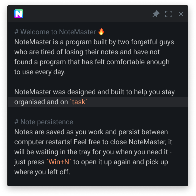

# Introduction

`NoteMaster` is a minimalist persistent note-taking app to help boost productivity.

<p align="center">
  
</p>

## Features

NoteMaster is being developed continuously by the maintainers. Our vision is to create the best minimal open-source note-taking app to boost productivity.

- Dark UI - Save your damn eyes!
- Persistent Notes - That's right! Your notes are saved as you type. RIP Save.
- Magical Highlighting - Separate the notes with them comments!
- Pin Window - Make NoteMaster fly high above other apps, so it's always visible.
- Fullscreen - Dive deep and go full screen for the ultimate note minimal note-making experience.
- Global Shortcut - Summon Notemaster using `Windows + N`. Honestly, it's magic.
- Preferences - It's a pick and mix of font size, font weight, line height, line numbers...
- Export - You heard it! Export them lovely notes to another place which you'll never open again.
- Find/Replace - You've become such as a `NoteMaster`(wow, that was bad) that you need to search!
- Search with Google - Quickly search your text selection on Google.
- Emoji Support - Yes... unreal, I know. You can now have so much fire in your notes.

## Supported Operating Systems
NoteMaster is currently only available for Windows. We require additional developers to help us bring experience to both Linux and macOS.

## Download NoteMaster
NoteMaster can be downloaded via [GitHub Releases](https://github.com/LiamRiddell/NoteMaster/releases). Please only download versions of NoteMaster that are hosted on GitHub. 

## Make NoteMaster Better

NoteMaster is built on top of [Electron React Boilerplate](https://electron-react-boilerplate.js.org/docs/installation). Please follow the [documentation provided.](https://electron-react-boilerplate.js.org/docs/installation) Cloning the repo for development is simple:

First, clone the repo via git:

```bash
git clone --depth 1 --single-branch --branch master https://github.com/LiamRiddell/NoteMaster.git notemaster
```

And then install the dependencies with yarn.

```bash
$ cd notemaster
$ yarn
```

## License

GNU GPLv3+ © [NoteMaster](https://github.com/LiamRiddell/NoteMaster/blob/master/LICENSE)

## Appreciations

Thanks to the following great projects that made NoteMaster possible:

- [Electron React Boilerplate](https://github.com/electron-react-boilerplate)
- [Monaco Editor](https://github.com/microsoft/monaco-editor)
