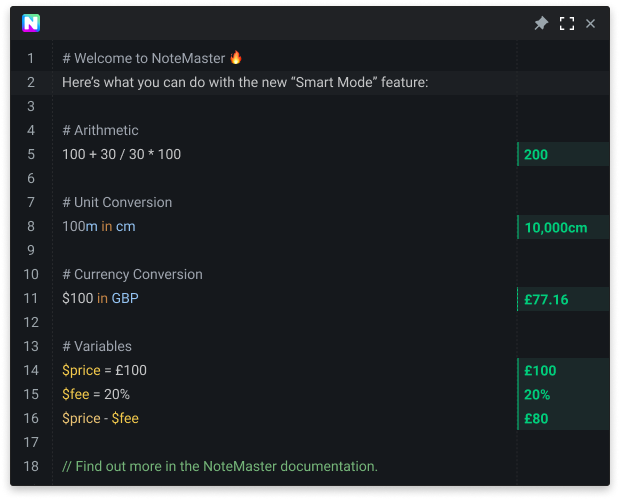

<p align="center">
  
</p>

<p align="center">NoteMaster is a smart minimalistic persistent note-taking app to help boost productivity.
</p>

<p align="center">
  <a href="https://www.producthunt.com/posts/notemaster?utm_source=badge-featured&utm_medium=badge&utm_souce=badge-notemaster" target="_blank"></a>
</p>

<p align="center">
  <a href="https://www.codacy.com?utm_source=github.com&amp;utm_medium=referral&amp;utm_content=LiamRiddell/NoteMaster&amp;utm_campaign=Badge_Grade"></a>
</p>

## Introducing Smart Mode

NoteMaster Beta introduces the first key feature that makes NoteMaster unique. Smart Mode automatically recognizes keywords, and intelligently provides results as you type, for example:

Arithmetic

```
100 + 10 + 10 -> 120
```

Unit Conversion

```
100cm in m -> 0.1m
```

Currency Conversion

```
$100 in GBP -> £77.3
```

Percentages

```
10% of 100 -> 10
```

That's not all! Head over to [our documentation](https://www.google.com) for a list of all of the statements that NoteMaster can recognize.

## Additional Features

NoteMaster is continuously being developed. Our vision is to create the best open-source, note-taking app that boosts our users productivity. We've already added so much:

- Dark UI - We love the slickness of a dark UI, plus it's better for your eyes. Win-win!
- Smart Mode - Let NoteMaster do the heavy lifting with quick calculations and conversions.
- Persistent Notes - That's right! Your notes are saved as you type. RIP Save As.
- Magical Highlighting - Separate your notes with comments!
- Pin Window - Make NoteMaster fly high above other apps, so it's always visible above the focused window.
- Fullscreen - Dive deep and go fullscreen for a more in-depth note-making experience.
- Global Shortcut - Summon NoteMaster using `Windows + N`. Honestly, it's magic.
- Preferences - Make it your own by customising the font size, font weight, line height, line numbers...
- Export - You heard it! Export those lovely notes to another place on your device where you'll never open them again.
- Find/Replace - Become a `NoteMaster` (wow, that was bad) with the search functionality!
- Search with Google - Quickly highlight and search the selected text on Google.
- Emoji Support - Yes... amazing, and absolutely essential - we know. You can now have so much fire in your notes.

## Supported Operating Systems

NoteMaster is now available on the following platforms:

- Windows
- Linux
- Mac

## Download NoteMaster

NoteMaster can be downloaded via [GitHub Releases](https://github.com/LiamRiddell/NoteMaster/releases). Please only download versions of NoteMaster that are hosted on GitHub.

## Contribute features to NoteMaster

NoteMaster is built on top of [Electron React Boilerplate](https://electron-react-boilerplate.js.org/docs/installation). To setup up local development workbench follow a few simple steps:

First, clone the repo via Git:

```bash
$ git clone --depth 1 --single-branch --branch master https://github.com/LiamRiddell/NoteMaster.git notemaster
```

and then install the dependencies with yarn.

```bash
$ cd notemaster
$ yarn
```

## Report a Bug

`NoteMaster` project is constantly finding ways to make you work more productive but while we implement new features bugs appear! [Report a bug.](https://github.com/LiamRiddell/NoteMaster/issues)

## License

GNU GPLv3.0 © [NoteMaster](https://github.com/LiamRiddell/NoteMaster/blob/master/LICENSE)

<a href="https://app.fossa.com/projects/git%2Bgithub.com%2FLiamRiddell%2FNoteMaster?ref=badge_large" alt="FOSSA Status"></a>

## Appreciations

Thanks to the following great projects that made NoteMaster possible. Please go and follow and support these projects.

- [Electron React Boilerplate](https://github.com/electron-react-boilerplate)
- [Monaco Editor](https://github.com/microsoft/monaco-editor)
- [Nearley](https://nearley.js.org/)
- [Moo](https://github.com/no-context/moo)
